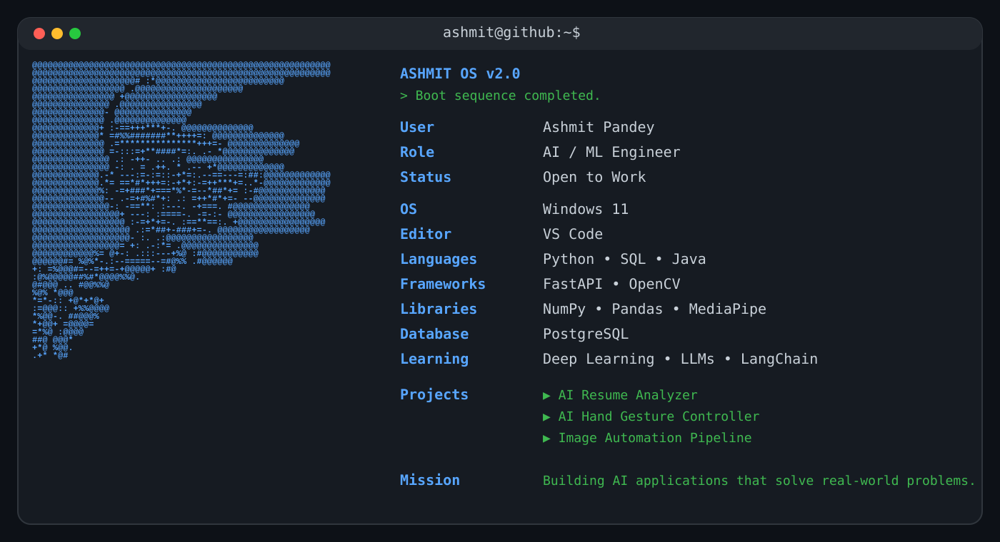

<div align="center">

#  Hi, I'm Ashmit Pandey

<p align="center">


</p>

### AI/ML Engineer • Python Developer • FastAPI • OpenCV



</div>

<p align="center">


</p>

## 💻 About Me

```yaml
Name: Ashmit Pandey

Role: AI/ML Engineer

Education:
  Bachelor of Engineering
  Artificial Intelligence & Machine Learning

Looking For:
  AI Engineer
  Python Developer
  Machine Learning Engineer

Interests:
  - Computer Vision
  - Artificial Intelligence
  - Backend Development
  - Automation
```

## ⚡ Tech Stack

```text
Programming Languages
──────────────────────────────────────────────

Python              ███████████████████░   92%

SQL                 █████████████████░░   88%

Java                ████████████░░░░░░░   65%


Backend Development
──────────────────────────────────────────────

FastAPI             ███████████████░░░░   82%

Flask               ████████████░░░░░░░   68%


Artificial Intelligence
──────────────────────────────────────────────

Machine Learning    ███████████████░░░░   80%

OpenCV              ████████████████░░░   85%

MediaPipe           ███████████████░░░░   82%

Transformers        ██████████░░░░░░░░░   60%


Data Science
──────────────────────────────────────────────

NumPy               ████████████████░░░   84%

Pandas              ███████████████░░░░   82%


Database
──────────────────────────────────────────────

PostgreSQL          █████████████░░░░░░   75%

MySQL               ███████████████░░░░   80%


Tools
──────────────────────────────────────────────

Git                 ███████████████░░░░   82%

GitHub              ███████████████░░░░   82%

VS Code             ██████████████████░   90%

Linux               ████████████░░░░░░░   68%
```

## 📈 GitHub Statistics

<p align="center">


</p>

<p align="center">


</p>

<p align="center">


</p>

## 📫 Connect With Me

<p align="center">

<a href="https://www.linkedin.com/in/ashmit299">


</a>

<a href="mailto:pandeyashmit299@gmail.com">


</a>

</p>
